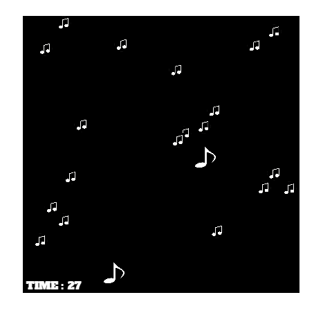

## Hackathon November 2022
# Team **Bazinga** presents: 
#   **Note Escape**  
## *Deliver the music note to the other side without bumping into a wrong note*

 
 

## About the Game
Space Race was originally made by Atari in 1973. Note Escape is our version of this simple game. It’s a co-op game. The idea is to get the avatar to the top of the map while avoiding music notes before the time runs out. The game ends when you run out of time.
 
 

## How to play
Click the mouse to start the game. 
Use W and S to move the music note on the left up and down.
Use the arrow keys to move the music note on the right up or down.
 
 

## Technology used
* HTML5
* P5.JS - Javascript library focused on making code accessible and inclusive.

## Known Bugs
* The player's and enemies music note hitboxes are slightly off because they are created by using the radius of their image. This can lead to some unfair deaths but also missing some enemies that should've hit you.

## Deployment
* Go to Github and open code in Gitpod.
* Run command npm install -g p5-server.
* Then run command p5 serve --open.
* Once the window is opened you may see a white screen that says home and assets on the top left.
* Click Assets and then my-sketch to open the game.
* If the game is unresponsive be sure to click it once with your mouse.

## Credits
* Fonts used were taken from Google Fonts: https://fonts.google.com/
* Original coding idea from Luke Garrigan [How to code Space Race! (1973) – 2](https://codeheir.com/2019/02/10/how-to-code-space-race-1973-2/)
* [Member 1/Scrum Master Linkedin](https://www.linkedin.com/in/keeganwaters/)

### Media
1. The image for playerMusicNote came from [Clipart Wondrous Design White Music Notes Note Clip - White Music Note @clipartmax.com](https://www.clipartmax.com/middle/m2i8H7N4K9b1Z5b1_clipart-wondrous-design-white-music-notes-note-clip-white-music-note/)
2. The image for enemyMusicNote came from [Music Note Icon from pngtree.com](https://png.pngtree.com/png-vector/20190329/ourlarge/pngtree-vector-music-note-icon-png-image_889465.jpg)